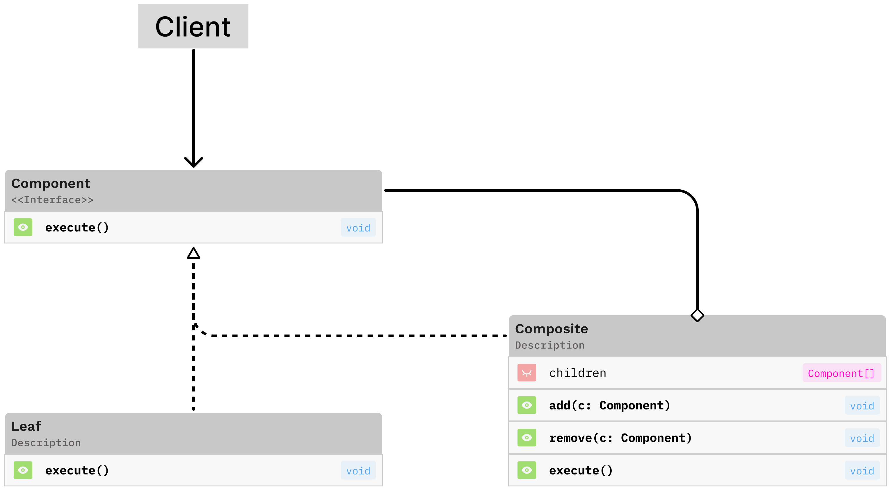

# Composite Pattern



## What is the composite pattern?

The composite pattern is used to provide an implementation that allows the clients to treat an individual object (leaf) and a composition of objects (composite) the same.

The main components include (1) a common interface, (2) a leaf(s) implementation, and (3) a composite implementation.

This pattern is great at representing tree-like structures where operations need to be performed across the entire tree.

It enables recursive composition, allowing objects to be nested to any depth while maintaining a consistent interface for client interaction.

### When to use the composite pattern

The composite pattern is useful when...

- You need to represent part-whole hierarchies of objects
- You want clients to ignore differences between individual objects and composite objects
- The structure of your objects can vary and be built dynamically
- You need to apply operation recursively over structured components

## Background

During my time at Loyola University Chicago, I spent a lot of time trying to find applications for each of the algorithms that I would learn about in my advanced algorithms courses. One of them, Djikstras algorithm, led me to create a project that was inspired by Uber, which later ended up being a larger part of my final project for the class. One of the difficulties that I tried to address, albeit not very successfully, was the idea of multiple rides (uber pools). This write up attempts to correct a few mistakes that I remember making and hopefully shows why implementing the composite pattern provides for a much better solution.

## What kind of problem is it solving?

The composite pattern is first and foremost a structural design pattern and should be considered when your program can be modeled into a tree-like structure. For example, take the sample code in [before.ts](./before.ts). We have individual classes for the different ride types, in this case an UberX and UberBlack, with their own implementations of calculateFare() and getDescription(). 

```typescript
class UberX {
		calculateFare(): number {
			...
		}

		getDescription(): string {
			...
		}
	}

	class UberBlack {
		calculateFare(): number {
			...
		}

		getDescription(): string {
			...
		}
	}
```

This works at a basic level when that is all the client needs, but we begin to see problems when calculating fares and getting descriptions requires more complexity. The fancier version (really just more complex, not really fancy, if I'm honest), FareCalculator, considers a few more factors when calculating/retrieving the fares and descriptions. It looks at whether the ride is occuring during peak hours, is an airport pickup, and if there is a special discount. This works... but what happens if more ride types are introduced? What if more factors need to be considered? This increases the complexity and we start to see a lot more if statements try to cover more situations.

```typescript
class FareCalculator {
		calculateTotalFare(
			rideType: RideType,
			distance: number,
			isPeakHours: boolean = false,
			isAirportPickup: boolean = false,
			hasSpecialDiscount: boolean = false
		): number {
			let totalFare = 0;

			// Calculate base ride fare
			if (rideType === RideType.UberX) {
				totalFare = 2.5 + distance * 1.5;
			} else if (rideType === RideType.UberBlack) {
				totalFare = 5 + distance * 2.5;
			} else {
				throw new Error("Unknown ride type");
			}

			// Add surcharges
			if (isPeakHours) {
				totalFare += 3.5;
			}

			if (isAirportPickup) {
				totalFare += 5;
			}

			// Apply discount
			if (hasSpecialDiscount) {
				totalFare -= 15;
			}

			return totalFare;
		}

		getDescription(
			rideType: RideType,
			distance: number,
			isPeakHours: boolean = false,
			isAirportPickup: boolean = false,
			hasSpecialDiscount: boolean = false
		): string {
			// similar to above method...
		}
	}
```

 We must also consider special cases, shown in the sample code as a corporate package. This tries implement a fare calculation based on multiple rides. This also works... but what if we need more special cases? Is adding more special cases really the best solution?

 ```typescript
class CorporatePackageCalculator {
		calculatePackageFare(
			rides: Array<{ type: RideType; distance: number }>,
			hasDiscount: boolean
		): number {
			let totalFare = 0;
			const fareCalculator = new FareCalculator();

			for (const ride of rides) {
				totalFare += fareCalculator.calculateTotalFare(
					ride.type,
					ride.distance,
					ride.type === RideType.UberX, // Assume UberX has peak hour surcharge for this example
					ride.type === RideType.UberBlack // Assume UberBlack has airport fee for this example
				);
			}

			if (hasDiscount) {
				totalFare -= 15;
			}

			return totalFare;
		}
	}
 ```

## add in the output from running the code

## What is the solution?

A better solution would be to implement the composite design pattern. Before we get their, it might be helpful to mention a few signs that may point to a possible implementation of the pattern. They could be:

- Parameter explosion -> we see this with the FareCalculator gaining more parameters as more factors were added
- Special cases -> we see this with the implementation of the CorporatePackageCalculator
- Repeated operations -> repeated operations of calculateFare() and getDescription(), this may point to needing a shared interface
- Possible tree-like structure -> we saw this start to take shape with the corporate package and being made up of multiple individual rides

The implementation of the composite pattern can be seen in [after.ts](./after.ts). The first thing to notice is the inclusion of the shared interface, RideComponent, for all of the ride components.

```typescript
	interface RideComponent {
		calculateFare(): number;
		getDescription(): string;
	}
```

Next are the implementations of two leaf components, SingleRide and RideSurcharge, which stemmed from the components that affected the fare in both the FareCalculator and the CorporatePackageCalculator. 

```typescript
	class SingleRide implements RideComponent {
		calculateFare(): number {
			...
		}

		getDescription(): string {
			...
		}
	}

	// Leaf: Specific ride pricing adjustments
	class RideSurcharge implements RideComponent {
		calculateFare(): number {
			...
		}

		getDescription(): string {
			...
		}
	}
```

Finally, we have the composite component, CompositeRide, that is meant to be made up of the RideComponents (this includes both the leaf and composite classes).

```typescript
class CompositeRide implements RideComponent {
		add(component: RideComponent): void {
			...
		}

		remove(component: RideComponent): void {
		    ...
		}

		calculateFare(): number {
			...
		}

		getDescription(): string {
			...
		}
	}
```

In main() we see how everything is simplified. We are still able to create individual rides using SingleRide and any additional objects that can affect the fare or description can be instantiated with RideSurcharge. Also, we are still able to get the fares/descriptions of the single rides we create, but we're also able to get that information from the composite rides, thanks to the shared interface.

## Output

```

```

## Helpful links

https://refactoring.guru/design-patterns/composite

https://www.youtube.com/watch?v=oo9AsGqnisk
