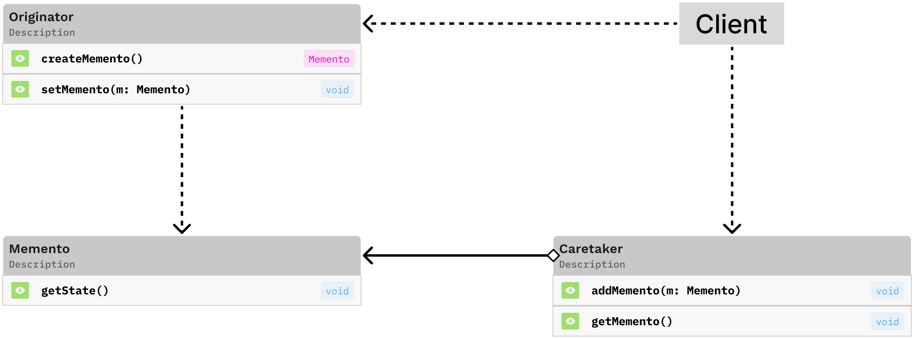

# Memento Pattern



## What is the memento pattern?

The memento design pattern is a behavioral pattern that allows the client to undo and redo the states of an object.

It consists of three key components: (1) the Originator, which creates and uses mementos to save its state, (2) the Memento, which stores the Originator's internal state, and (3) the Caretaker, which keeps track of the mementos but never modifies them.

### When to use the memento pattern

The memento pattern in most helpful when...

- you need to implement undo/redo functionality
- you want to create snapshots of an object's state as it changes
- you want to maintin encapsulation when preserving state history

## Background

At my current role, one of the projects that I have spent a lot of time on revolves around users entering in many materials into a database. This is one small feature and was completed really early on in the project as it was essential for the features that came after it. This "Add Material" feature works well, but almost a year later, we have started to get user feedback that they would like some kind of undo/redo button. While we don't really have the time to go an implement something right now, this writeup serves to hint at a possible solution that leverages the memento design pattern.

## What kind of problem is it solving?

There are many situations when you want to be able to undo and redo, a really common example that is used is a text editor. In [before.ts](./before.ts), we look at an example of a client editing a form. It doesn't take a whole lot to view/edit the form and the private values are accessible via getters and setters in the Material class.

```typescript
class Material {
		private _name: string;
		private _density: number;
		private _color: string;
		private _transparent: boolean;
		private _history: Array<{
			name: string;
			density: number;
			color: string;
			transparent: boolean;
		}> = [];

		constructor(
			name: string,
			density: number,
			color: string,
			transparent: boolean
		) {
			this._name = name;
			this._density = density;
			this._color = color;
			this._transparent = transparent;
		}

		get getName(): string {
			...
		}
		set setName(name: string) {
			...
		}

		get getDensity(): number {
			...
		}
		set setDensity(density: number) {
			...
		}

		get getColor(): string {
			return this._color;
		}
		set setColor(color: string) {
			...
		}

		get isTransparent(): boolean {
			...
		}
		set setTransparent(transparent: boolean) {
			...
		}
	}
```

We don't see a whole lot of issues here, but we start to see some trouble when we want to allow the client to undo their changes. Typically the trouble starts when we are trying to create the snapshots for the undo functionality. How can we create these snapshots? In many cases you may choose to iterate over all of the fields in an object and save their values into some kind of data structure. This may work, but you don't always have access to the fields, which can be set to private. A solution may be to simply make the fields public, but is that always an option? Not really. I was able to get around this by having two classes (Material + MaterialForm) where Material handles all of the logic for setting and getting all of the material details and also handles the undo logic so that MaterialForm doesn't need to access the private fields. This works... but we run into a few issues, specifically we are still exposing our private fields with our history array being made up of an object using public fields, the Material class now has more responsibilities and the history implementation is now tightly coupled to the Material class as well.

## Output -- Before

```
Initial state:
Material: Glass, Density: 2.5, Color: Clear, Transparent: true
Updated name to: Tempered Glass
Updated density to: 2.8
Updated color to: Slight blue tint

After changes:
Material: Tempered Glass, Density: 2.8, Color: Slight blue tint, Transparent: true

Undoing last change (color change):
Material: Tempered Glass, Density: 2.8, Color: Clear, Transparent: true

Undoing another change (density change):
Material: Tempered Glass, Density: 2.5, Color: Clear, Transparent: true

Undoing another change (name change):
Material: Glass, Density: 2.5, Color: Clear, Transparent: true

Trying to undo again (no more to undo):
Nothing to undo!
```

## What is the solution?

A better solution would be to implement the memento design pattern.

We can see the implementation of this in [after.ts](./after.js). We start with the creating MaterialMemento class that takes the role of the memento in the pattern. The main responsibilty of this class is to store the state of the Material.

```typescript
	class MaterialMemento {
		private _name: string;
		private _density: number;
		private _color: string;
		private _transparent: boolean;

		// Getters for the stored state (only accessible to the Originator)
		getName(): string {
			...
		}

		getDensity(): number {
			...
		}

		getColor(): string {
			...
		}

		isTransparent(): boolean {
			...
		}
	}
```

We also have a Material class, that takes up the role of the originator in the pattern, whose role is to do a lot of the base functionality of a material (get + set data) while also saving and restoring mementos.

```typescript
	class Material {
		private _name: string;
		private _density: number;
		private _color: string;
		private _transparent: boolean;

		// Save current state into a memento
		saveToMemento(): MaterialMemento {
			...
		}

		// Restore state from a memento
		restoreFromMemento(memento: MaterialMemento): void {
			...
		}

		// Getters and setters
		get getName(): string {
			...
		}

		set setName(name: string) {
			...
		}

		get getDensity(): number {
			...
		}

		set setDensity(density: number) {
			...
		}

		get getColor(): string {
			...
		}

		set setColor(color: string) {
			...
		}

		get isTransparent(): boolean {
			...
		}

		set setTransparent(transparent: boolean) {
			...
		}
	}
```

Then we also have MementoHistory class that acts as the caretaker. The main responsibility of this class is to handle the logic for managing the history of the mementos (undo, redo, adding to history, + checks).

```typescript
	class MementoHistory {
		// Add a memento to history
		push(memento: MaterialMemento): void {
			...
		}

		// Get the previous memento (for undo)
		undo(): MaterialMemento | null {
			...
		}

		// Get the next memento (for redo)
		redo(): MaterialMemento | null {
			...
		}

		// Check if undo is available
		canUndo(): boolean {
			...
		}

		// Check if redo is available
		canRedo(): boolean {
			...
		}
	}
```

And similar to the original implementation, we have a MaterialForm class that is what the client interacts with and has all the functionality abstracted away into the other classes.

This approach offers the following advantages:

- Better separation of concerns
- Enhanced encapsulation (the Memento's state is only accessible to the Originator)
- More flexible implementation of undo/redo operations
- Cleaner, more maintainable code

## Output -- After

```
Material: Glass, Density: 2.5, Color: Clear, Transparent: true
Updated name to: Tempered Glass
Updated density to: 2.8
Updated color to: Slight blue tint
Material: Tempered Glass, Density: 2.8, Color: Slight blue tint, Transparent: true

Undoing the last change:
Undo successful
Material: Tempered Glass, Density: 2.8, Color: Clear, Transparent: true

Undoing another change:
Undo successful
Material: Tempered Glass, Density: 2.5, Color: Clear, Transparent: true

Redoing a change:
Redo successful
Material: Tempered Glass, Density: 2.8, Color: Clear, Transparent: true

Making a new change after undo:
Updated transparency to: false
Material: Tempered Glass, Density: 2.8, Color: Clear, Transparent: false

Trying to redo (should fail):
Nothing to redo
```

## Helpful Links

https://refactoring.guru/design-patterns/memento

https://www.geeksforgeeks.org/memento-design-pattern/

https://www.youtube.com/watch?v=_Q5rXfGuyLQ
